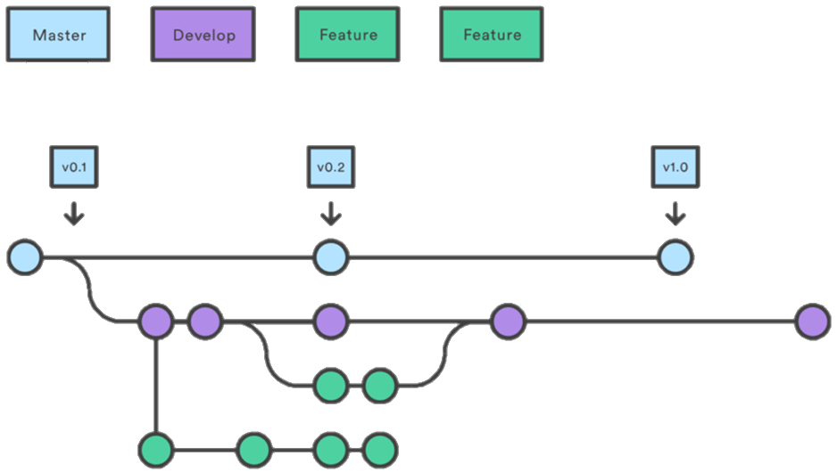

# Metodologia

Pré-requisitos: <a href="2-Especificação do Projeto.md"> Documentação de Especificação</a>

Nessa seção apresentamos as ferramentas utilizadas para a produção e gestão do projeto.

## Controle de Versão

A ferramenta de controle de versão adotada no projeto foi o
[Git](https://git-scm.com/), sendo que o [Github](https://github.com)
foi utilizado para hospedagem do repositório.

### Relação de Ambientes de Trabalho 

Na tabela a seguir temos a relação dos ambientes de trabalho com suas respectivas plataformas e links de acesso. Cada ambiente foi pensado com o objetivo de melhorar a qualidade da produtividade dos desenvolvedores.

|**Ambiente**|**Plataforma**|**Link de acesso**|
|:---:|:---:|:---:|
|Repositório de código fonte|GitHub|[Github](https://github.com/)|
|Documentos do projeto|GitHub|[Github](https://github.com/)|
|Projeto de Interface e Wireframes |MarvelApp |[MarvelApp](https://marvelapp.com/prototype/ai50gdj)|
|Gerenciamento do Projeto |GitHub|[Github](https://github.com/) |

### Gestão de código fonte

O fluxo de controle de código ideal é Main – Develop – Feature. Foi utilizado a branch Main para gerar as novas versões no projeto, já a Develop é usada especialmente para realizar merge entre a Main e as novas branchs de Features no final das sprints. 

## Gerenciamento de Projeto

### Divisão de Papéis

A equipe utiliza metodologias ágeis, tendo escolhido o Scrum como base para definição do processo de desenvolvimento. A equipe está organizada da seguinte maneira:  

*Scrum Master:* Diego 

*Product Owner:*  Gabriel 

Equipe de desenvolvimento:  Lucas, Mikaelly, Marina, Thassia, Bruno, Diego e Gabriel.

#### Fluxo de produção

>*Backlog:* recebe as tarefas a serem trabalhadas e representa o Product Backlog.  
>*To do:* Esta lista representa o Sprint Backlog. Este é o Sprint atual que estamos trabalhando.  
>*In progress:* Quando uma tarefa tiver sido iniciada, ela é movida para cá.  
>*Implemented:* A tarefa foi implementada e está pronta para a fase de testes.  
>*Test and review:* Checagem de qualidade.  
>*Done:* Tarefas concluídas e enviadas.  
>*Locked:* Tarefas que impedem o progresso do projeto.  

A tarefas são, ainda, etiquetadas em nível de prioridades: Highest, High, Low e Next sprint.

