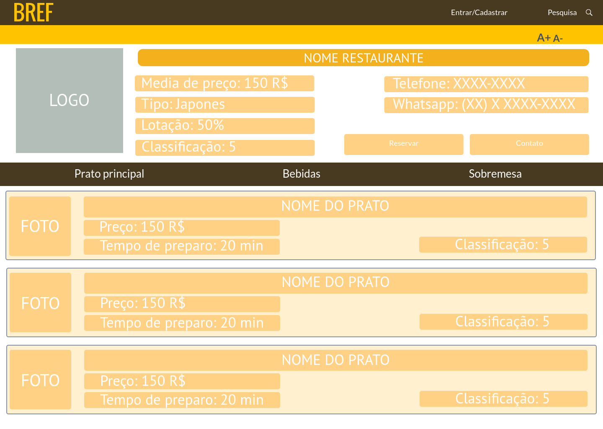
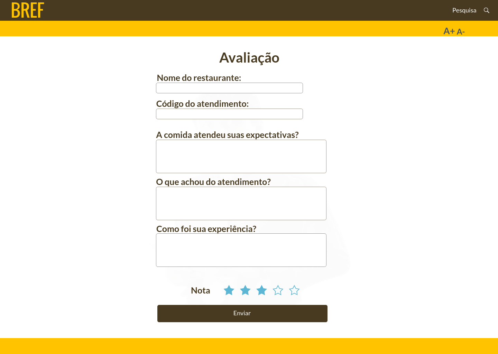

# Projeto de Interface

Visão geral da interação do usuário pelas telas do sistema e protótipo interativo das telas com as funcionalidades que fazem parte do sistema (wireframes).
 Aqui será apresentado as principais interfaces da plataforma. Onde mostramos como atendemos os requisitos funcionais, não funcionais e histórias de usuário.

## User Flow
O fluxo de usuário (User Flow) mostra como o será a navegação do usuário pelas páginas do site.

## Wireframes

Protótipos de como serão o design de interface do site. 

 ### Página Inicial

A página inicial, mostra os restaurantes mais bem avaliados da plataforma, uma barra de pesquisa e navegação, informações de como entrar em contato e recurso que ajuda na acessibilidade, ultilizado para aumentar e reduzir o tamanho da fonte. Ao clicar na miniatura de um restaurante o cliente será redirecionado para uma página com mais informações. 

### Tela de entrar

Tela de entrar possui na direita imagens randômicas sobre os restaurantes, campos para e-mail e senha onde usuário terá acesso a sua conta. Caso ele não possua cadastro poderá clicar no botão de registrar uma nova conta. Se ele não lembrar de sua senha estará disponível um botão de recuperar senha. 

### Cadastro

Campos para nome completo, data de nascimento, CPF, e-mail e senha, um botão de registrar e botões para alteração do tamanho da fonte. Ao clicar na logo o usuário volta para a página inicial.

### Recuperar senha

Tela que permite ao usuário a recuperar a senha.  Colocando seu e-mail e clicando no botão para gerar o código de verificação será enviado ao email digitado e ele poderá coloca-lo em outro campo que aparecerá na página. 

### Informações dos restaurantes

Nesta página estará todas as informações relevantes sobre o restaurante selecionado, como: cárdapio, disponibilidade de mesa, contato, média de preço, tempo de preparo dos pratos e reservas. Botão de acessibilidade para aumentar e diminuir a fonte.

### Lista de restaurantes

Nesta página contém botão de pesquisa, informações básicas sobre a lista de restaurantes disponiveis e um filtro de pesquisa que possibilita o usuário escolher baseado em: média de preço, classificação do restaurante, lotação, tempo de espera, tipos de restaurantes , métodos de pagamento e cidade. Um botão para filtrar que ao ser clicado alterará os restaurantes baseados no filtro. Botão de acessibilidade de para aumentar e diminuir a fonte. Ao clicar em logo usuário volta para página inicial. 

### Reserva

O usuário deverá colocar seus dados de número de celular, e-mail, quantidade de lugares a ser reservados, data e horário. Caso houver disponibilidade a reserva é confirmada por uma tela que abrirá. 

### Reserva concluída
 
 Recebimento de confirmação de reserva, feita na tela anterior pelo usuário. Ao clicar em *Ok* o usuário será redirecionado a página inicial.

### Contato

Espaço destinado para usuários mandarem dúvidas, sugestões e reclamações. Campos a ser prenchidos com nome completo, e-mail, telefone de contato, e a mensagem. Ao clicar no botão enviar o usuário será redirecionado para página inicial.

### Avaliação

O usuário poderá dar *feedback* da sua  experiência sobre o restaurante e avaliar em uma nota com estrelas de 1 a 5.

### Sobre nós

 Espaço destinado a conhecer melhor sobre o site e suas funcionalidades. Ao clicar na logo o usuário retornará a página inicial.

