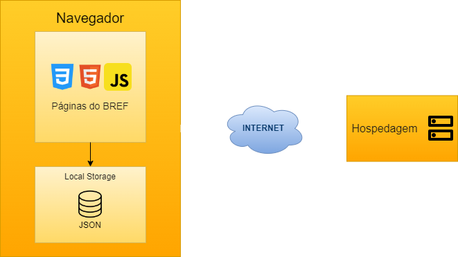

# Arquitetura da Solução

Definição de como o software é estruturado em termos dos componentes que fazem parte da solução e do ambiente de hospedagem da aplicação.

## Diagrama de componentes

Diagrama que permite a modelagem física de um sistema, através da visão dos seus componentes e relacionamentos entre os mesmos.

Exemplo: 

Os componentes que fazem parte da solução são apresentados na figura a seguir.

Figura do diagrama - Arquitetura da Solução

A solução implementada conta com os seguintes módulos:
- **Navegador** - Interface básica do sistema  
  - **Páginas Web** - Conjunto de arquivos HTML, CSS, JavaScript e imagens que implementam as funcionalidades do sistema.
   - **Local Storage** - armazenamento mantido no Navegador, onde são implementados bancos de dados baseados em JSON. São eles: 
     - **Usuários** - seções de notícias apresentadas 
     - **Restaurantes** - registro de opiniões dos usuários sobre as notícias
     - **Avaliações** - lista de notícias mantidas para leitura e acesso posterior
 - **Hospedagem** - local na Internet onde as páginas são mantidas e acessadas pelo navegador. 

## Tecnologias Utilizadas

O site utiliza as seguintes ferramentas:

- **HTML**: utilizada para a estruturação do site, com o objetivo de enquadrar cada informação.
- **CSS**: utilizada para estilizar o site e organizar as informações visualmente.
- **JavaScript**: utilizado para a estruturação das funções que o site fornece.

## Hospedagem

O método de hospedagem será o Github Pages. (DÚDIVA) -> FICA A NOSSO CRITÉRIO

Explique como a hospedagem e o lançamento da plataforma foi feita.

