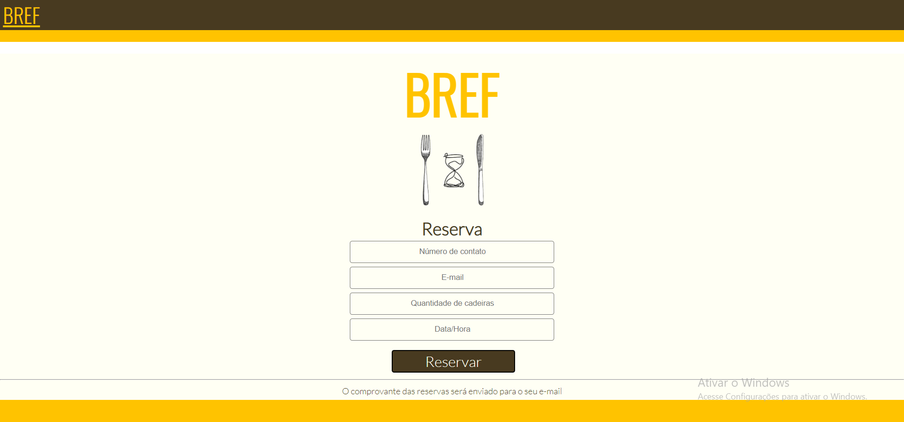

# Template do site

Definição de como serão as páginas e suas funcionalidades.

O template é composto pelos seguintes layouts:
- **Tela principal**
- **Melhores restaurantes**
- **Menu de navegação**
  - **Sobre nós**
  - **Fale conosco**
  - **Barra de pesquisa**
  - **Entrar/Cadastrar**
- **Reserva de mesas** 
  
## Tela Principal

Tela que abrange todas as visualizações iniciais do site e a lista de notícias gerais.

## Melhores Restaurantes

Esse layout é utilizado para apresentar os três restaurantes com melhores notas.

## Menu de Navegação

Local onde o usuário tem a opção de navegar através das páginas do site.

## Reserva de mesas

Tela da visualização inicial ao introduzir a opção de reserva de mesa.

## Preenchimento dos dados

Campos para preenchimeto com dados dos clientes para reserva de mesas em um dos restaurantes cadastrados no sistema.

