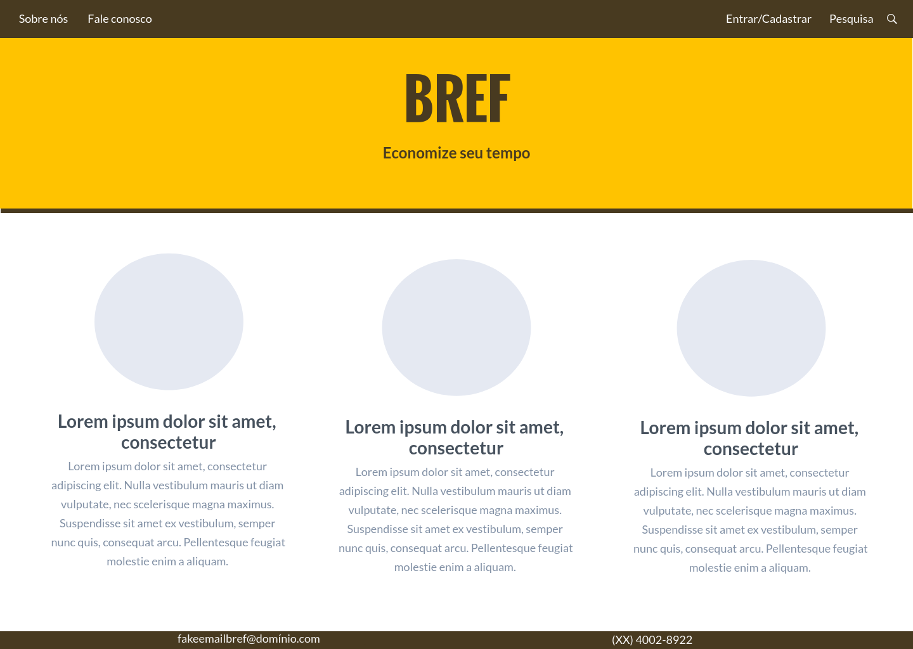

# Template do site

Definição de como serão as páginas e suas funcionalidades.

O template é composto pelos seguintes layouts:
- **Tela principal** -
- **Melhores restaurantes** -
- **Menu de navegação** -
  - **Sobre nós** -
  - **Fale conosco** -
  - **Barra de pesquisa** -
  - **Entrar/Cadastrar** -

Layout padrão do site (HTML e CSS) que será utilizado em todas as páginas com a definição de identidade visual, aspectos de responsividade e iconografia.

