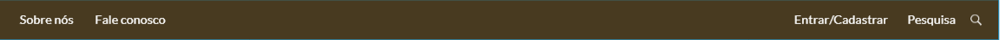
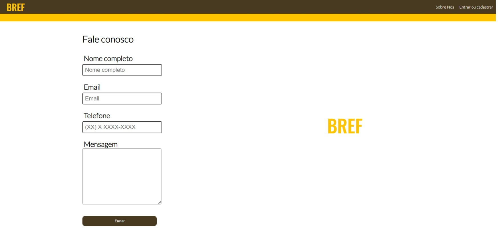
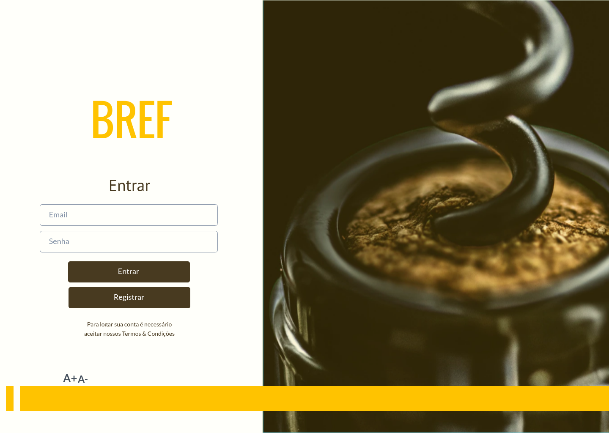
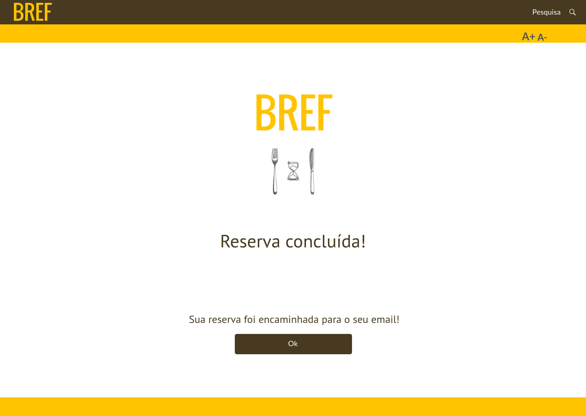

# Template do site

Definição de como serão as páginas e suas funcionalidades.

O template é composto pelos seguintes layouts:
- **Tela principal**
- **Melhores restaurantes**
- **Menu de navegação**
  - **Sobre nós**
  - **Fale conosco**
  - **Barra de pesquisa**
  - **Entrar/Cadastrar**
- **Reserva de mesas** 
  
## Tela Principal

Tela que abrange todas as visualizações iniciais do site e a lista de notícias gerais.

## Melhores Restaurantes

Esse layout é utilizado para apresentar os três restaurantes com melhores notas.

## Menu de Navegação

Local onde o usuário tem a opção de navegar através das páginas do site.

**Barra de pesquisa**

Barra onde onde cliente vai poder pesquisar pelo nome do restaurante. Ícone de "pesquisa".

**Sobre nós**

Faz uma breve apresentação da empresa para o usuário.

**Fale conosco**

Tela que o cliente vai poder entrar em contato.

**Entrar/Cadastrar**

Login e formulário para cadastro do cliente.

## Reserva de mesas

Campos para preenchimeto com dados dos clientes para reserva de mesas em um dos restaurantes cadastrados no sistema.

**Reserva Concluida**

Confirma se a mesa está reservada.

