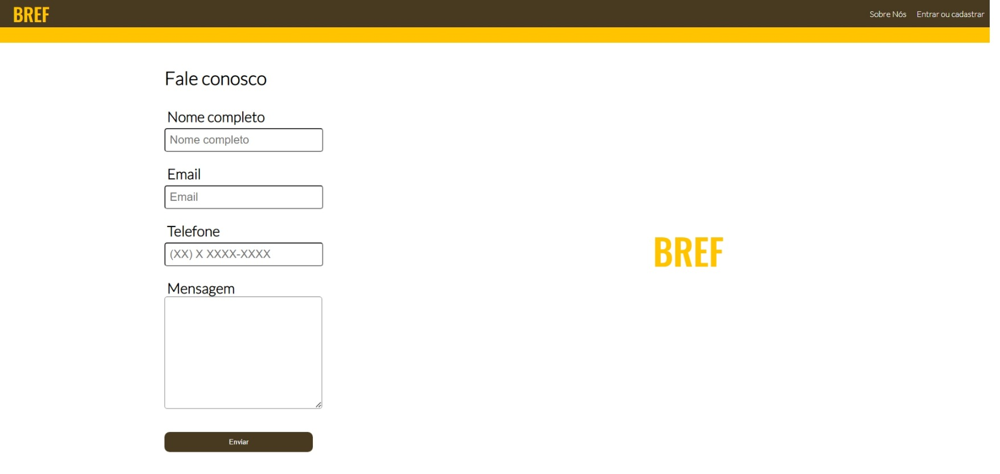

# Programação de Funcionalidades

### Contato com os desenvolvedores

O site possui uma página destinada apenas ao contato com os responsáveis pelo site, a página "Fale Conosco". É utilizado um formulário com os campos Nome, e-mail, telefone e mensagem.

#### Requisito atendido

**RF-12** O site deve ter uma página de contato com os desenvolvedores da solução.

#### Artefato da funcionalidade

* fale-conosco.html
* reset.css
* fale-conosco.css

#### Instruções de acesso

* Faça o download do arquivo do projeto (ZIP) ou clone do projeto no GitHub;
* Descompacte o arquivo em uma pasta específica;
* Abra a pasta descompactada
* Abra o arquvivo ./src/code/html/fale-conosco.html

### Entrar / Cadastrar conta

O site possui uma página em que o usuário poderá cadastrar e entrar em sua conta para ter acesso a todo o conteúdo.

#### Requisito atendido

**RF-13** O site deve ter uma página de contato com os desenvolvedores da solução.

* entrar.html
* reset.css
* entrar.css
* entrar.js

#### Instruções de acesso

* Faça o download do arquivo do projeto (ZIP) ou clone do projeto no GitHub;
* Descompacte o arquivo em uma pasta específica;
* Abra a pasta descompactada
* Abra o arquvivo ./src/code/html/entrar.html
