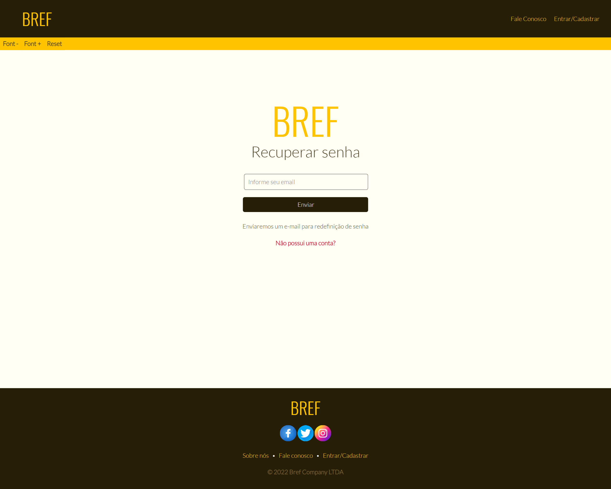
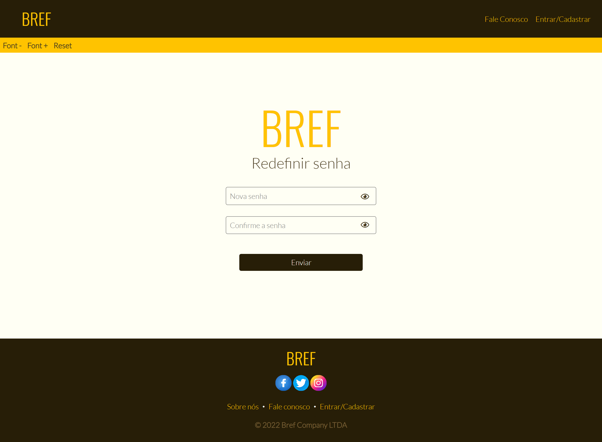
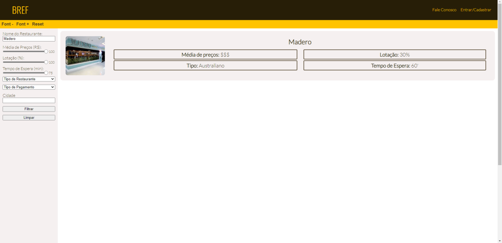
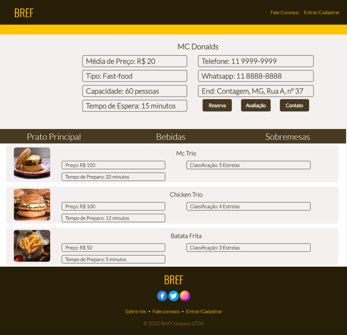
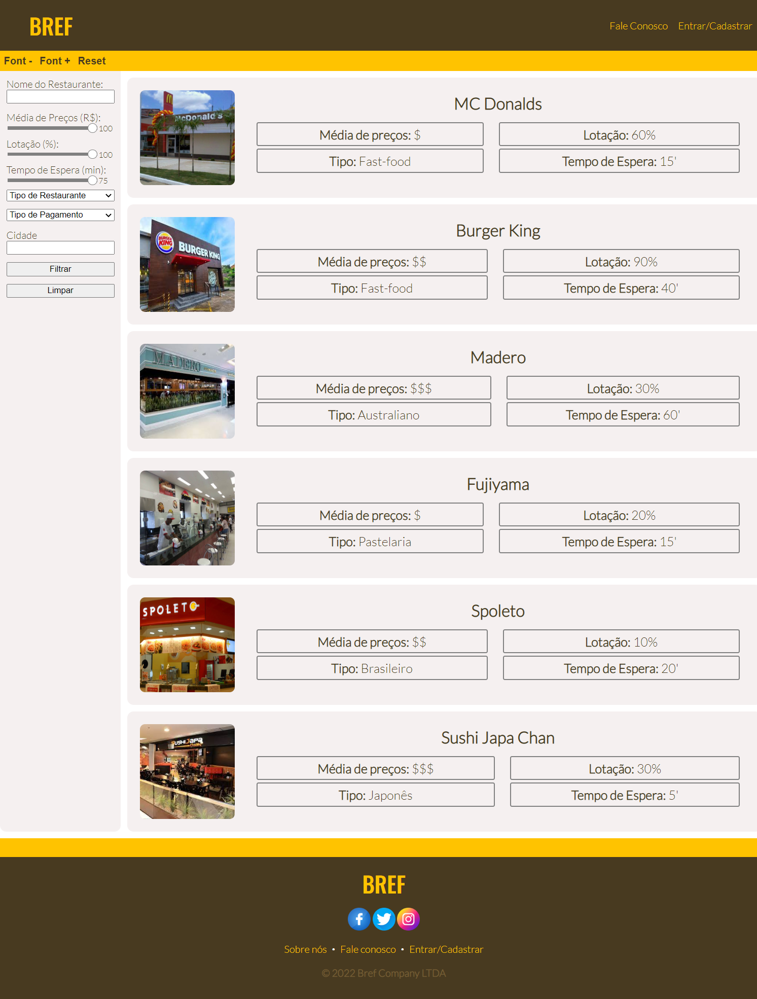

# Programação de Funcionalidades

## F01 - Entrar, Cadastrar conta e Recuperar senha

O site possui uma página em que o usuário poderá cadastrar e entrar em sua conta para ter acesso a todo o conteúdo, possui também uma página para recuperação e redefinição de senha.

#### *Requisito atendido*

**RF-013** O site deve ter uma página para entrar em uma conta ou cadastrar. 
**RF-014** O site deve ter uma página para recuperação/redefinição de senha. 

#### *Artefato da funcionalidade*

* entrar-cadastrar.html
* recuperar-senha.html
* entrar-cadastrar.css
* recuperar-senha.css
* entrar-cadastrar.js
* recuperar-senha.js
* reset.css

#### *Instruções de acesso*

* Acesse https://icei-puc-minas-pmv-ads.github.io/pmv-ads-2022-1-e1-proj-web-t3-bref/entrar-cadastrar.html
* Para a página de recuperar senha: https://icei-puc-minas-pmv-ads.github.io/pmv-ads-2022-1-e1-proj-web-t3-bref/recuperar-senha.html ou entre em entrar-cadastrar.html e clique em "Esqueceu a senha?"

## F02 - Filtros de busca

A ferramenta de filtros auxilia na busca pelo restaurante da preferêcia do usuário.

#### *Requisito atendido*

RF-005 O site deve oferecer uma forma de pesquisa para localidades dos restaurantes.
RF-006 O site deve permitir que o usuário encontre a melhor opção de restaurante por sua localidade, formas de pagamento ou produtos presentes no menu utilizando uma ferramenta de filtro.
RF-008 O site deve apresentar um menu de categorias, para categorizar os restaurantes de acordo com o tipo de comida que é servido.

#### *Artefato da funcionalidade*

* listagem-restaurantes.html
* reset.css
* listagem-restaurantes.css

#### *Instruções de acesso*

* Acesse https://icei-puc-minas-pmv-ads.github.io/pmv-ads-2022-1-e1-proj-web-t3-bref/listagem-restaurantes.html

## F03 - Função Lupa

Essa ferramenta do site é voltada às pessoas que querem uma fonte de tamanho maior, para que possam ler melhor o conteúdo do site.

#### *Requisito atendido*

**RF-011** O site deve permitir que o usuário possa alterar o tamanho da fonte.

#### *Artefato da funcionalidade*

* Em todas as páginas html que possuírem no cabeçalho a barra de 'font-|font+|reset'

#### *Instruções de acesso*

* Acesse https://icei-puc-minas-pmv-ads.github.io/pmv-ads-2022-1-e1-proj-web-t3-bref

## F04 - Barra de busca

A barra de busca serve para encontrar um restaurante. Ela retorna o restaurante que buscou ou, caso não encontre, retorna uma lista de restaurantes recomendados.

#### *Requisito atendido*

**RF-007** Deve ser disponibilizado uma barra de busca, para ser encontrado algum restaurante em específico.

#### *Artefato da funcionalidade*

* listagem-restaurantes.html

#### *Instruções de acesso*

* Acesse https://icei-puc-minas-pmv-ads.github.io/pmv-ads-2022-1-e1-proj-web-t3-bref/listagem-restaurantes.html
* Digite na barra de busca a esquerda o restaurante desejado.

## F05 - Fale Conosco

Essa página permite que o usuário consiga entrar em contato com os responsáveis do site.

#### *Requisito atendido*

**RF-012** O site deve ter uma página de contato com a empresa BREF.

#### *Artefato da funcionalidade*

* fale-conosco.html
* reset.css
* fale-conosco.css

#### *Instruções de acesso*

* Acesse https://icei-puc-minas-pmv-ads.github.io/pmv-ads-2022-1-e1-proj-web-t3-bref/fale-conosco.html

## F06 - Apresentação das informações dos restaurantes

A funcionalidade tem por objetivo retornar todas as informações do restaurante para o usuário que estiver acessando a página com o id do restaurante.

#### *Requisito atendido*

**RF-001** O site deve apresentar de forma clara o cardápio e formas de pagamentos dos restaurantes. 
**RF-002** O site deve apresentar, para cada restaurante, o seu endereço.

#### *Artefato da funcionalidade*

* info-restaurante.html
* ../css/reset.css
* ../css/info-restaurante.css
* ../css/footer.css
* ../bootstrap-css/bootstrap.min.css

#### *Instruções de acesso*

* Acesse a página info-restaurante.html com o parâmetro id. Ex.: https://icei-puc-minas-pmv-ads.github.io/pmv-ads-2022-1-e1-proj-web-t3-bref/info-restaurante.html?id=3

## F07 - Tempo de espera

Na página de listagem de restaurantes, aparecerá nos cards o tempo de espera de cada restaurante. 

#### *Requisito atendido*

**RF-003** O site deve permitir ao usuário visualizar o tempo de espera e as reservas que podem ser feitas no dia

#### *Artefato da funcionalidade*

* listagem-restaurantes.html
* reset.css
* listagem-restaurantes.css

#### *Instruções de acesso*

* Acesse https://icei-puc-minas-pmv-ads.github.io/pmv-ads-2022-1-e1-proj-web-t3-bref/listagem-restaurantes.html

## F08 - Reservar Restaurante

A ferramenta permite que o usuário reserve um horário no restaurante selecionado.

#### *Requisito atendido*

**RF-004** O site deve oferecer ao usuário entrar na fila online ou fazer uma reserva quando o restaurante disponibilizar esse serviço.

#### *Artefato da funcionalidade*

* reserva.html
* reservaConcluida.html
* reset.css
* reserva.css
* reservaConcluida.css

#### *Instruções de acesso*

* Acesse https://icei-puc-minas-pmv-ads.github.io/pmv-ads-2022-1-e1-proj-web-t3-bref/reserva.html

## F09 - Contato com o restaurante

A ferramenta permite que o usuário seja redirecionado a uma API do WhatsApp para que ele possa entrar em contato com o restaurante selecionado

#### *Requisito atendido*

**RF-009** O site deve permitir que o cliente tenha meios de contato direto com os restaurantes escolhidos.

#### *Artefato da funcionalidade*

* info-restaurante.html
* ../css/reset.css
* ../css/info-restaurante.css
* ../css/footer.css
* ../bootstrap-css/bootstrap.min.css
#### *Instruções de acesso*

* Acesse a página info-restaurante.html com o parâmetro id. Ex.: https://icei-puc-minas-pmv-ads.github.io/pmv-ads-2022-1-e1-proj-web-t3-bref/info-restaurante.html?id=3
* Clique no botão "Contato"

## F10 - Avaliação do restaurante

A ferramenta permite que o usuário possa avaliar o restaurante selecionado, fazendo comentários e dando estrelas.

#### *Requisito atendido*

**RF-010** O site deve permitir que usuários possam dar avaliações sobre os restaurantes.

#### *Artefato da funcionalidade*

* info-restaurante.html
* ../css/reset.css
* ../css/info-restaurante.css
* ../css/footer.css
* ../bootstrap-css/bootstrap.min.css
* avaliacao.html
* avaliacao.css

#### *Instruções de acesso*

* Acesse a página info-restaurante.html com o parâmetro id. Ex.: https://icei-puc-minas-pmv-ads.github.io/pmv-ads-2022-1-e1-proj-web-t3-bref/info-restaurante.html?id=3
* Clique no botão "Avaliacao"
* Ou pode acessar diretamente a página avaliacao.html com o parâmetro name. Ex.: https://icei-puc-minas-pmv-ads.github.io/pmv-ads-2022-1-e1-proj-web-t3-bref/avaliacao.html?name=%27Madero%27
