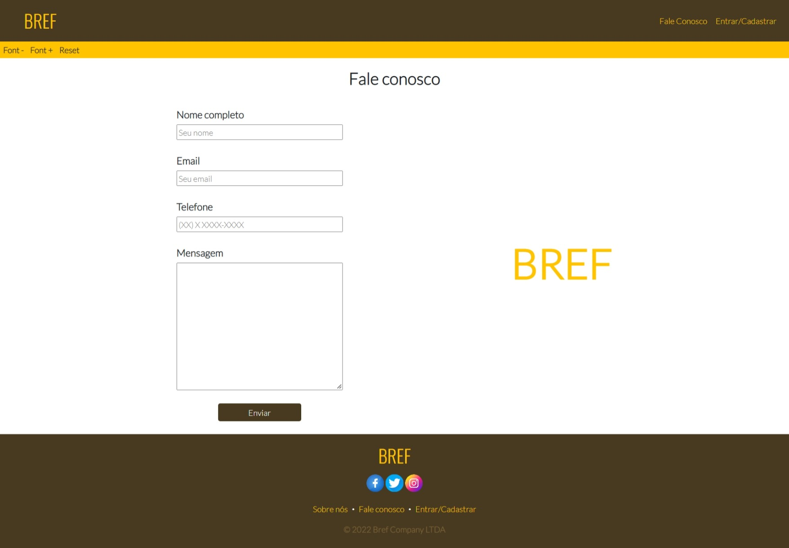
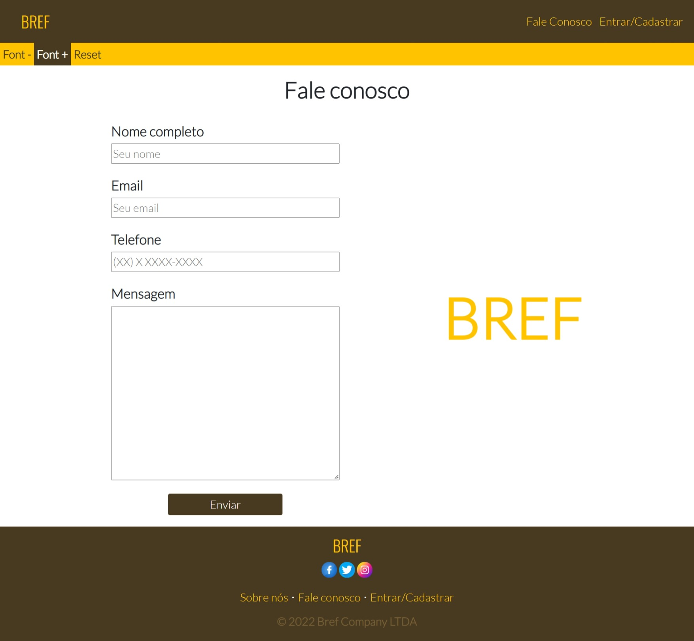
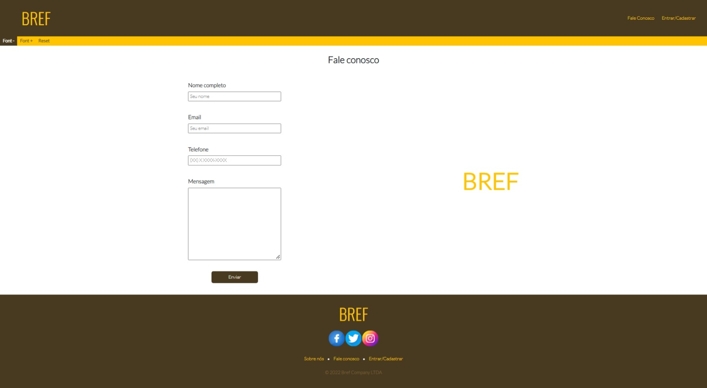
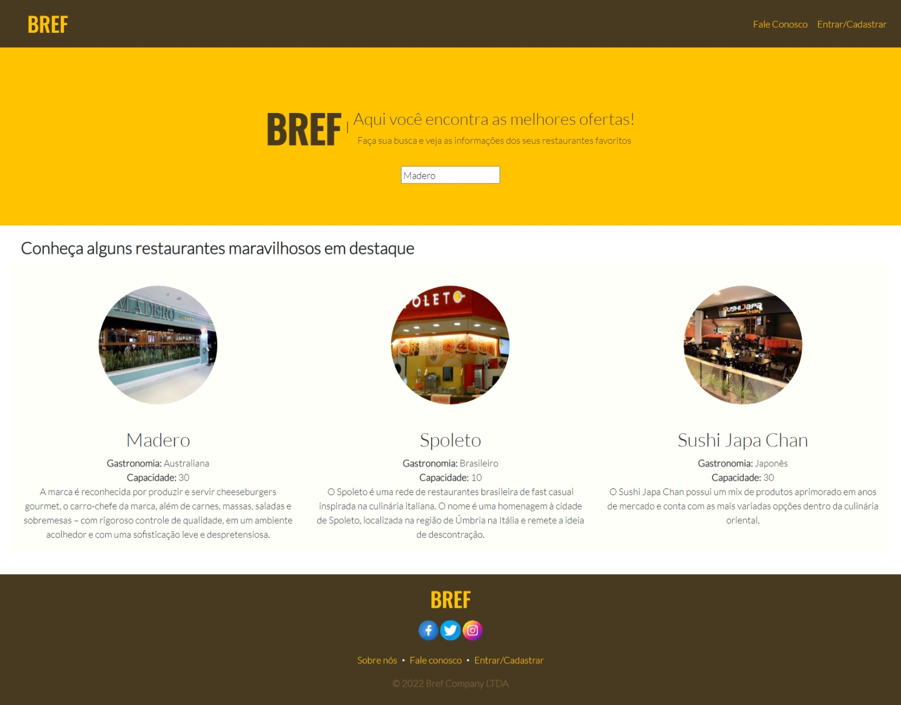
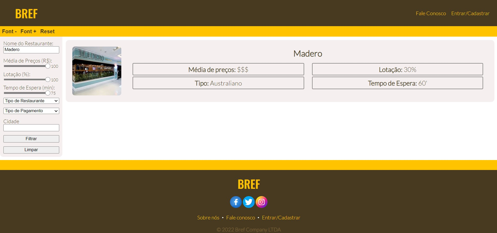
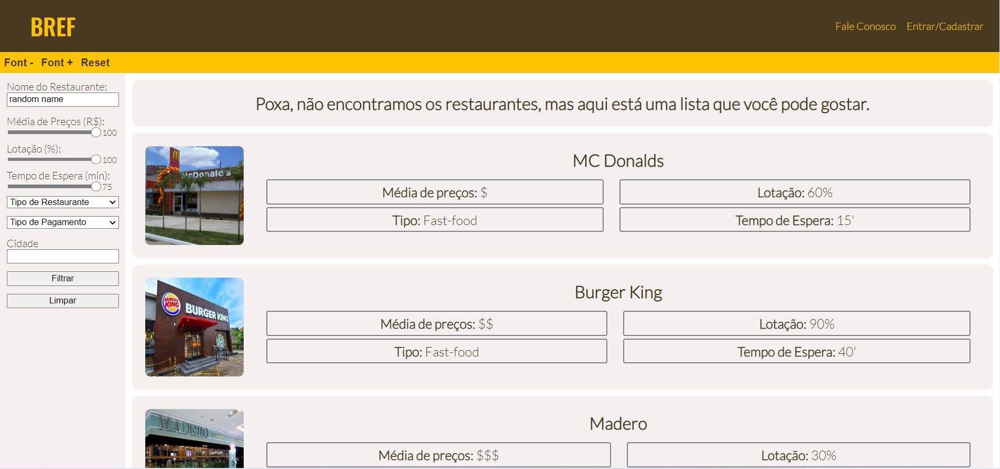

# Registro de Testes de Software

## CT-01 - Verificar a função Lupa 

>### Original e Reset: 
>
>
>### Font+: 
>
>
>### Font-: 
>

## CT-02 - Verificar a barra de busca 

>### Barra de busca Sucesso: 
>
>
>### Retorno Sucesso: 
>

>### Barra de busca Nome aleatório: 
>
>
>### Retorno Nome aleatório: 
>

## CT-03

## CT-04 - Visualização das informações do restaurante

>### Retorno Nome aleatório: 
>

