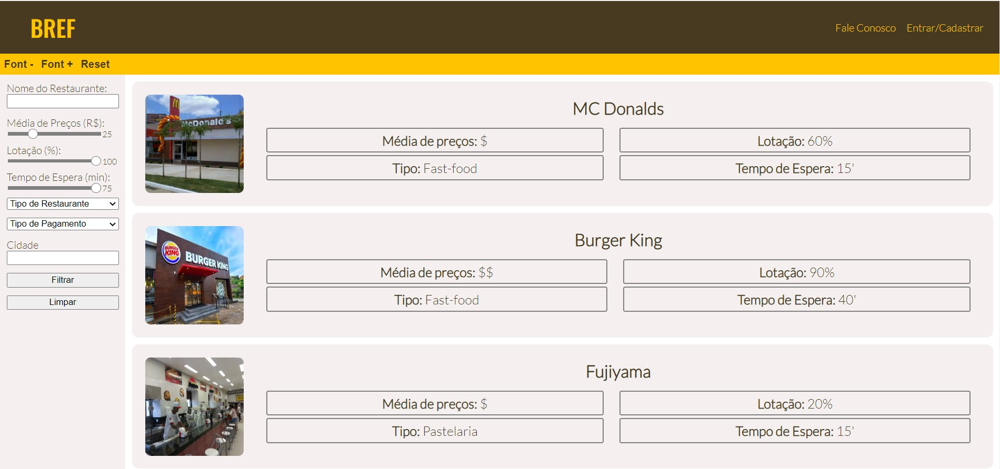
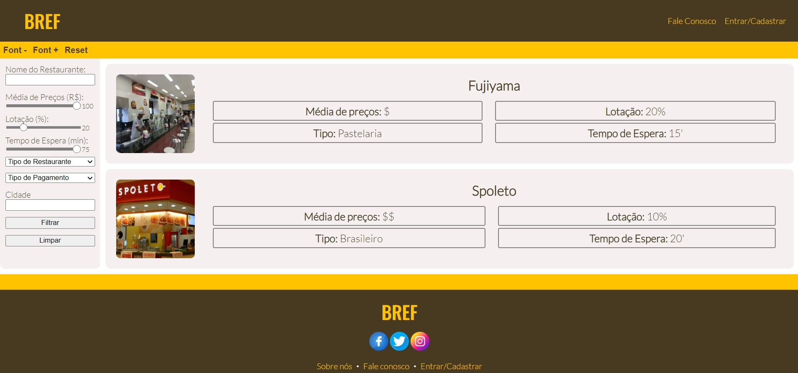
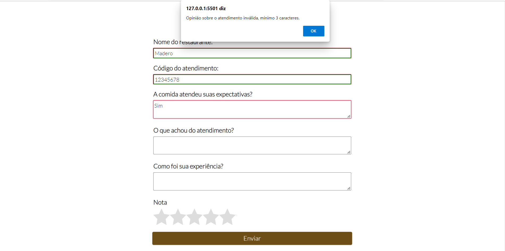

# Registro de Testes de Software

## CT-01 - Verificar a função Lupa 

>### Original e Reset:
>
>
>### Font+:
>
>
>### Font-:
>

## CT-02 - Verificar a barra de busca 

>### Barra de busca Sucesso:
>
>
>### Retorno Sucesso:
>

>### Barra de busca Nome aleatório:
>
>
>### Retorno Nome aleatório:
>

## CT-03 - Teste de formulários da página Fale Conosco

>### Nome inválido:
>

>### E-mail inválido:
>

>### Telefone inválido:
>

>### Mensagem inválida:
>

>### Sucesso:
>

## CT-04 - Visualização das informações do restaurante

>### Retorno das informações dos restaurantes
>

## CT-05 - Cadastro e login de usuário

>### Entrar - Default
>

>### Entrar - Sucesso
>

>### Entrar - Erro em email ou senha incorreta
>

>### Cadastrar - Default
>

>### Cadastrar - Cadastrando...
>

>### Cadastrar - Sucesso
>

>### Cadastrar - Erro faltando campos a serem preenchidos
>

>### Recuperar senha - email invalido
>

>### Recuperar senha - sucesso
>

>### Redefinir senha - senha invalida
>

>### Redefinir senha - sucesso
>

## CT-06 - Testar filtros de busca

>### Fitro Barra de busca
>

>### Filtro Média de preço
>

>### Filtro Lotação
>

>### Filtro Tempo de espera
>

>### Filtro Tipo de restaurante
>

>### Filtro Tipo de Pagamento
>

>### Filtro Cidade
>

>### Filtros que não encontram restaurante
>

## CT-07 - Visualizar o tempo de espera

>### Página listagem de restaurantes com restaurantes de exemplo
>

## CT-08 - Reserva de mesas

>### Página criar reservas - Default
>

>### Criar reserva - Sucesso
>

>### Criar reserva - Reserva Concluída
>

>### Criar reserva - Email inválido
>

>### Criar reserva - O email é obrigatório
>

>### Criar reserva - Número de contato é obrigatório
>

>>### Criar reserva - Número de contato inválido
>

>### Criar reserva - Informe o número de cadeiras a serem reservadas
>

>### Criar reserva - Preencha os dados corretamente
>

## CT-09 - Contato com o restaurante

>### Botão de contato na página de informações do restaurante
>

>### API do WhatsApp que deve ser redirecionada
>

## CT-10 - Endereço do Restaurante
>### A informação sobre o restaurante pode ser vista na parte superior direita. Acima dos botões de reserva, avaliação e contato.
>

## CT-11 - Avaliação do restaurante

>### Botão de avaliação na página de informações do restaurante
>

>### Página de avaliação
>

>### Erro Código de Atendimento
>

>### Erro Opinião Inválida
>

>### Erro opinião sobre atendimento inválida
>

>### Erro Opinião de experiência inválida
>

>### Sucesso
>
